# Technical Question Submission 

As a precursor, this was a great technical question! I had a lot of fun experimenting with different networks and playing around with the results.

I do not own a CUDA enabled GPU, therefore my implementation runs via a Colab notebook:

    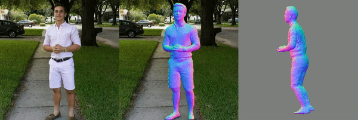

## Survey of current SOTA
The first phase of this question involved surveying the latest 3D human reconstruction networks, with the following conditions: 
- The input being a single  mp4 file.
- The output being a set of either 3D meshes or point clouds, ideally one for each frame.

I've worked previously with ONet, PIFu and NeRF networks. PIFuHD was my initial first guess at a potential solution to this question as it was trained for high-detail human reconstruction (including clothing). However, it is always worth a trip to google scholar to check forward citations. Through this I was able to find ICON (code released in Feb 2022). My reasons for selecting ICON as my chosen solution are as follows:
- ICON has a full, well documented codebase, with access to a plug-and-play Colab notebook for easy testing.
- The ICON paper demonstrates results that consistently outperform PIFu / PIFuHD, with particularly better generalisation to dramatic / athletic poses through use of local (rather than global) features.

In the next section I will give a high-level overview of the theory behind ICON and its network architecture.
## ICON architecture rundown

    

The ICON architecture consists of two parts, with an optional optimisation loop:
1.  First, we create normal predictions for the front and back side of the human:
    - This involves inferring a SMPL-body mesh (denoted as , provided by [PyMAF](https://hongwenzhang.github.io/pymaf/)) from the input image. 
    - Then, using a differentiable renderer (denoted as ), we obtain a front and back SMPL-body normal maps (denoted as ).
    - Combining the SMPL-body normal maps with the original rgb image, ICON uses two trained normal prediction networks (denoted as ) to infer front / back clothed-body normal maps.
2. (Optional) These predicted clothed-body normal maps can be further optimised by passing them through a refinement loop, where we iteratively minimise the difference between the rendered SMPL-body normal-maps and the predicted clothed-body normal maps.
3. When we have the final inferred clothed-body normal maps, we then predict occupancy for a query point P by feeding a local feature vector into an MLP. The local feature vector consists of:
    - The signed distance from P to the closest body point on the SMPL-body mesh.
    - The [barycentric surface normal](https://www.scratchapixel.com/lessons/3d-basic-rendering/ray-tracing-rendering-a-triangle/barycentric-coordinates) of the closest body point on the SMPL-body mesh.
    - A normal vector extracted from either the front or the back inferred clothed-body normal map, depending on visibility.

Using this architecture, we can begin building an [octree](https://iq.opengenus.org/octree/) by querying different points, which can then be converted to a mesh via marching cubes. 
## Results
Here I will provide a few talking points from my results using ICON.

    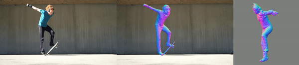

From the above gif, we can see that the results for a well lit, well positioned subject are reasonable (aside from the missing limb, discussed in limitations section)

    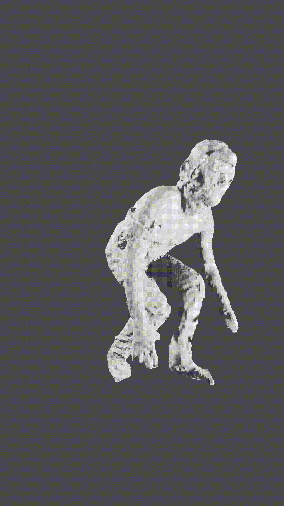
    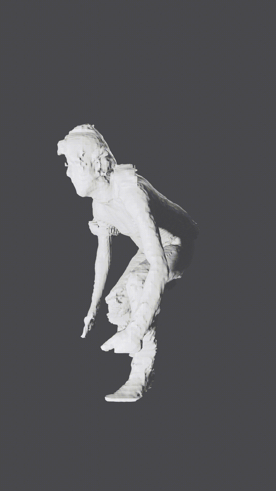 

However, one result doesn't speak for an entire video sequence. After loading up Blender (I know the technical question said use Unity, I was too late to turn back  when I realised!) and importing 35 Skateboarder models, I realised one of the disadvantages of this network was the lack consistency in scale / position between successive models. I had to manually adjust each of them so the video could run smoothly.

You can tell from the above-left gif that, if viewing from the perspective of the camera, the motion looks very smooth. However, when panning 90 degrees away from that perspective, as shown in the above-right gif, the motion looks jagged. This is a natural consequence of using a single camera, as there are a bunch of positions a limb can be in that satisfy the 'silhouette' produced by the single camera. This issue will no doubt be mitigated by the inclusion of more views.

    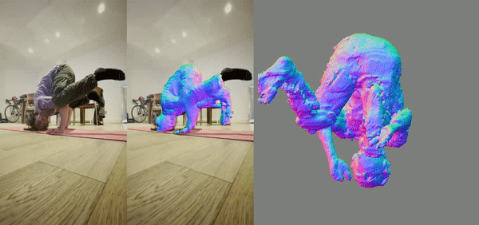

From the above gif, we can see that the model can capture a subject (me!):

1. In a complex, self occluding pose
2. In an oddly lit environment
3. With a complex background

The main error of this example is that, unfortunately, I'm not strong enough to hold myself up with just my head and one hand... my left arm (or right arm? difficult to tell!) should also be on the floor, but is instead confused with a chair leg, hence the outstretched arm.

<mark>For all results, please visit my [drive](https://drive.google.com/drive/folders/1xygUupnc9odJoez8_j0NtFabPszJr-bD?usp=sharing). Once uncompressed, you can find the output .objs under 'icon-filter/obj'. </mark>

## Advantages of ICON (Specific to Metacast)
- Pose Generalisation
    - Many of the datasets used to train human reconstruction networks (RenderPeople) are limited in pose variation. 
    - Past SOTA networks suffered when exposed to 'dramatic' poses as they utilised global image features (i.e. taking the whole image into account), which overfit to poses seen during training. 
    - In contrast, ICON uses local features (generated from a combination of pose estimation and normal map prediction), which allows for better generalisation to unseen poses.
    - As Metacast is attempting to reconstruct athletic / dynamic poses, ICON is the better suited network for generalisation and precision (not speed!).
- Quality of output
    - Comparing directly to PIFu's architecture, the inclusion of a mesh-based statistical model (PyMAF) in ICON greatly reduces 'non-human' artifacts, at the expense of having a generic look to all outputs (further discussed in limitations section). This also combats the effect of image blur.
        

            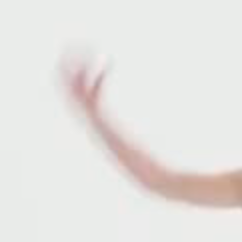
            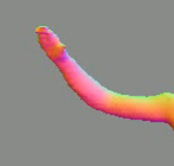 
        

## Limitations of ICON (Specific to Metacast)
- The first obvious limitation - ICON is far from a real-time solution, standing at 30.7 seconds per frame. Through omission of the normal map optimisation loop, the iteration time for a single frame was greatly reduced to 4.4s (using Colab's Tesla-P100 instances), with only a slight difference in model quality.
- ICON only takes single images as input and infers the backside normals. As discussed in the results section, single images will naturally lead to some positioning errors. This can be mitigated through incorporating multiple views.
- (mentioned in results section) ICON is designed to work as a single image reconstructor, rather than a video reconstructor. As frames from the .mp4 are reconstructed individually, there is currently no consistency in scale / position between successive models. This could be rectified in the future by restructuring ICON to work as a recurrent network, where the output of each frame is conditioned on the output of previous frames.
- By using a pretrained mesh-based statistical model (PyMAF), the output mesh is currently limited to a single human. This means (1) No equipment is reconstructed (2) Only single humans are reconstructed. From what I gathered in PyMAF's paper, to solve these problems new pose and shape estimation models would have to be trained for each sport. As a loose example, to reconstruct a fencing scene we would need to:
    - Alter PyMAFs SMPL models to include 2 people, and 2 swords.
    - Retrain PyMAF on annotated fencing data (i.e. pixel perfect positions for both people and both swords for each frame of training data). This would take a long time to implement!

- SMPL-body prediction relies on PyMAF, which exposes it to PyMAF failure cases. In their words - "Though PyMAF can improve the alignment of some body parts, it remains challenging for PyMAF to correct those body parts with severe deviations, heavy occlusions, or ambiguous limb connections". For instance, occluded regions can sometimes cause missing limbs  
        

            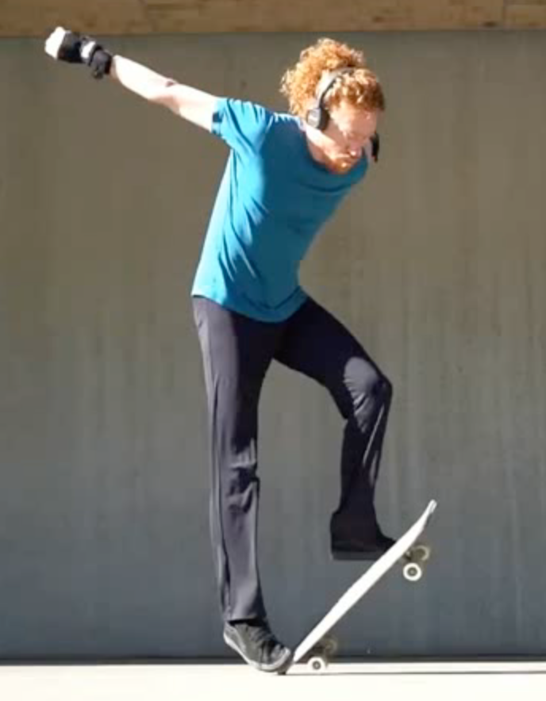
            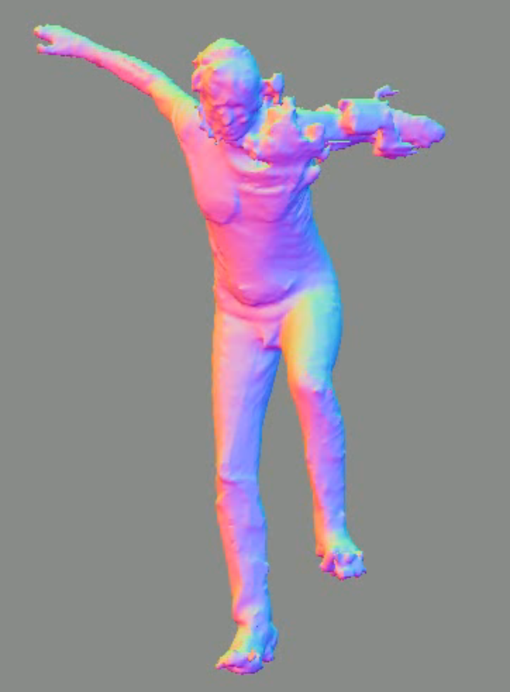 
        

    
- From what I gathered from the paper, ICON concerns itself only with geometry, and leaves the texturing to [SCANimate](https://scanimate.is.tue.mpg.de/). However, when viewing the .obj files in my system, I can clearly see a textured 'refine' model. There is no accompanying .mtl file, and when I open the 'refine' .obj in a text editor, there is no mention of materials, so I'm not quite sure whats going on there at the moment!
    

            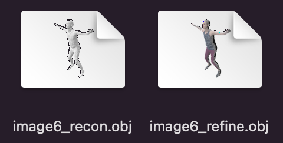  
    
 

- (nitty-gritty) ICON assumes weak perspective cameras, which makes it susceptible to failure when subjects are close to the lens / distorted. In a UFC ring subjects might get very close to cameras.
## Improvements Made
The improvements that I mention in the limitations section are non-trivial, and require a whole rework of the model and / or the training data, which is beyond the scope of this exercise. 

For this technical question, I will instead focus on mesh post-processing to obtain a simplified mesh surface whilst preserving as much original detail as possible. This will help to lesten the memory footprint of the generated .obj models. I will use the [Fast Quadric Mesh Simplifier](https://github.com/sp4cerat/Fast-Quadric-Mesh-Simplification) implementation present in the [ONet codebase](https://github.com/autonomousvision/occupancy_networks).

    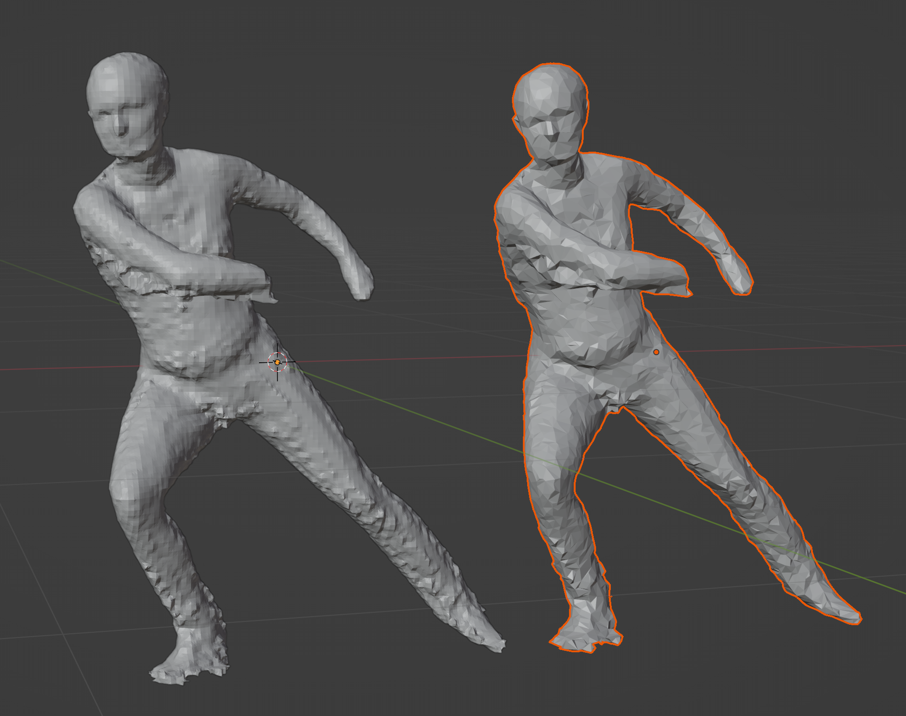

The above meshes are 5.1MB and 346KB in size respectively. You can find the 'fqms' files in the same directory as the ICON obj results.

## Testing and Evaluation
- At training time, I have found the best quantitative metric for evaluating outputs has been 3D IOU.
- At test time, we have no ground truth model for 3D IOU calculations, therefore evaluation becomes more tricky.
- However, if we could (1) output the inferred extrinsic camera coordinates and (2) line up the reconstruction silhouette with the original video, we would then be able to run 2D IOU on the ground truth video segmentation vs the silhouette of the reconstruction (I believe ICON already uses this approach as a loss function).
- This is still a poor way of measuring performance, as we're only using one view. The model could extend infinitely in the direction the camera is facing and still achieve a good score.
- To tag an output as 'reasonable' you could use a 2D IOU threshold (e.g. 90%).

## EXTRA - Other Approaches
As a side note - if an output 3D mesh wasn't a requirement, recent NeRF networks (https://github.com/NVlabs/instant-ngp) would definitely catch my eye:
- NeRF networks train on a single scene, take camera coordinates as input and give 2D images as output.
- From a realism standpoint, the detail, colour and material properties (reflections, roughness etc) of NeRF's 2D outputs far outpace 3D mesh generation networks, at the cost of having no output mesh to work with.
- Facebook have just released [Neural 3D Video Synthesis from Multi-view Video](https://neural-3d-video.github.io) (no code yet), which has the ability to process multi-view video, rather than just static scenes. Very exciting! 
 - NeRF is best suited to high detail video. Therefore it could work great for small-area sports (UFC), as you can get the camera close to the action. However, for large-area sports (football) the detail of the reconstruction will suffer due to the distance.

- Limitations:
    - NeRF networks require very beefy GPUs and are prone to VRAM overflow related crashes.
    - NeRF networks require multiple cameras to achieve good results, so the monocular video data provided with this task wouldn't be usable.
    
